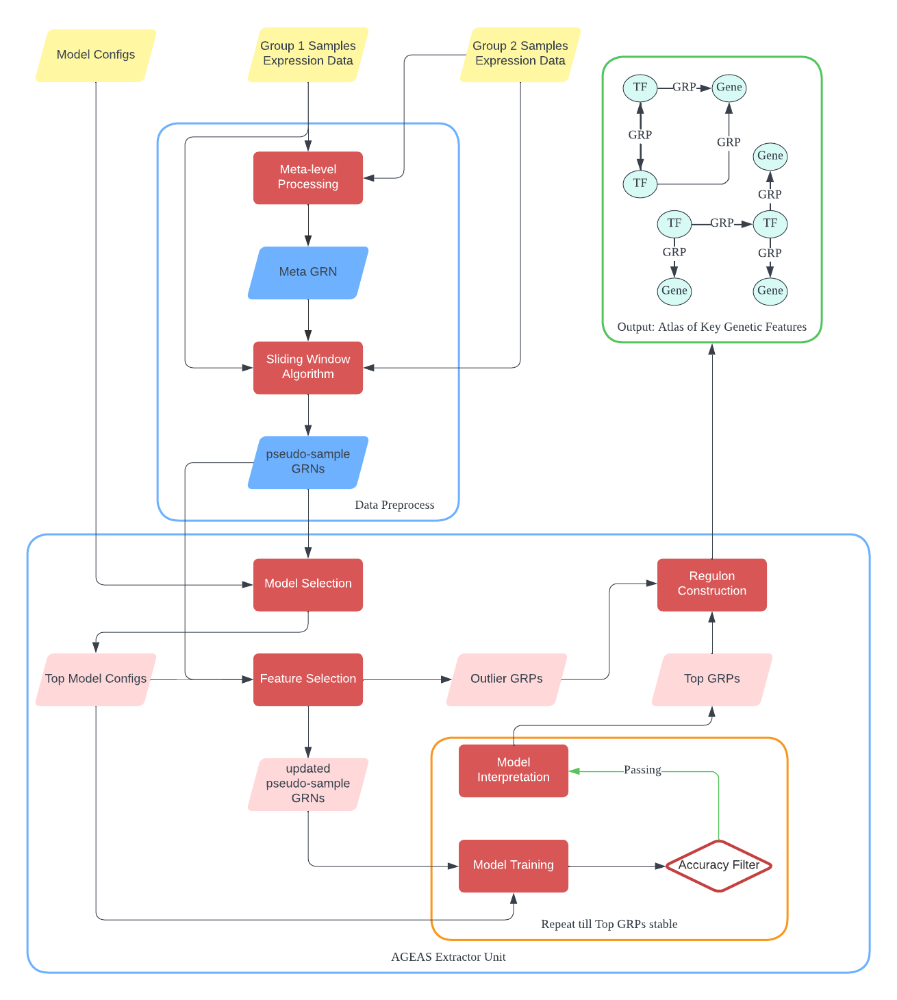

.. AGEAS documentation master file, created by
   sphinx-quickstart on Thu Jun 23 16:03:52 2022.
   You can adapt this file completely to your liking, but it should at least
   contain the root `toctree` directive.

Welcome to AGEAS's documentation!
=================================

**AGEAS (AutoML-based Genomics fEatrue extrAction System)** is to find key genomics factors,
including genes and regulatory pathways, in determining cellular phenotype.

.. note::

   This project is under active development.

Workflow Summary
=================================

Install
=================================

AGEAS can be installed from either `PyPI <https://pypi.org/project/Ageas/>`_ ::

  pip install ageas

or cloned from `GitHub <https://github.com/nkmtmsys/Ageas/>`_ ::

  git clone https://github.com/nkmtmsys/Ageas.git
  cd Ageas
  pip install .

Test
=================================

After installation, a performance test can be carried out with::

  import ageas
  ageas.Test(protocol = 'multi')

Contents
=================================
.. toctree::
   :maxdepth: 2

   API reference <api>
   Examples <examples>
